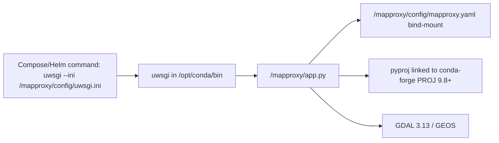

# Custom MapProxy image with PROJ 9.8+

## Why the official image is wrong for EPSG:4087

[`ghcr.io/mapproxy/mapproxy/mapproxy:7.0.0-nginx`](https://github.com/mapproxy/mapproxy/blob/master/Dockerfile) is `python:3.14-slim-bookworm` plus Debian `libgdal-dev` / `libgeos-dev`. Bookworm's PROJ is **9.1.1**. Ellipsoidal Equidistant Cylindrical (EPSG method 1028, used by [EPSG:4087](https://epsg.io/4087)) only landed in [PROJ 9.8.0](https://github.com/OSGeo/PROJ/releases/tag/9.8.0) ([issue #4654](https://github.com/OSGeo/PROJ/issues/4654), [PR #4656](https://github.com/OSGeo/PROJ/issues/4656)). Older PROJ silently uses spherical method 1029, so a 5°N point comes out at Y ≈ `556597 m` instead of ≈ `552885 m`.

conda-forge currently ships the combination we need: **Python 3.14**, **GDAL 3.13.x**, **PROJ 9.8.1**. MapProxy itself is not on conda-forge (only an abandoned `auto/mapproxy 1.6.0`), so it still comes from PyPI like the official image.

**Stay on Python 3.14. Do not pin `python=3.15.0rc2`.** conda-forge publishes the 3.15 RC (as of 2026-09-03, via `conda-forge/label/python_rc`), but their own [migration note](https://conda-forge.org/blog/2026/09/03/python-315/) says only the interpreter, noarch packages, and stable-ABI (`abi3`) extensions are ready; the compiled-package rebuild (GDAL, shapely, lxml, Pillow, …) starts after a `python315` pin lands. A few packages already have stray `py315` builds (e.g. uwsgi 2.0.31), but that is not a complete, solver-safe GIS stack. MapProxy 7.0.0's PyPI classifiers stop at 3.14 (it is a pure-Python wheel, so it would *install* on 3.15 untested). The official `7.0.0-nginx` image we are mimicking is 3.14. PROJ 9.8 is independent of the Python minor version, so 3.15 buys nothing for the EPSG:4087 fix. Revisit after 3.15.0 final and after conda-forge's `python315` migration has rebuilt `gdal`/`pyproj`/`shapely`/`lxml`/`pillow`/`uwsgi` for linux/amd64 and linux/arm64.

## What “mimic 7.0.0-nginx” means here

This repo never starts the image's bundled nginx ([docker-compose.4087.yaml](docker-compose.4087.yaml) runs `uwsgi --ini /mapproxy/config/uwsgi.ini`; Helm does the same). The custom image will match the **parts actually used**:

- Python 3.14 + MapProxy 7.0.0 + **uwsgi**
- WSGI app at `/mapproxy/app.py` loading `/mapproxy/config/mapproxy.yaml` ([official `docker/app.py`](https://raw.githubusercontent.com/mapproxy/mapproxy/master/docker/app.py))
- uid/gid **1000:1000** (existing `chown` in [deploy.sh](deploy.sh) / install docs)
- bash (Compose healthcheck)
- glibc (Debian slim), not Alpine

It will **not** install nginx, `run-nginx.sh`, or compile uwsgi from pip.



## Image layout

New files at repo root / under `mapproxy/`:

- [`Dockerfile.mapproxy`](Dockerfile.mapproxy) — sibling of [`Dockerfile.assets`](Dockerfile.assets)
- [`mapproxy/environment.yml`](mapproxy/environment.yml) — conda-forge pins
- [`mapproxy/docker/app.py`](mapproxy/docker/app.py) — vendored copy of upstream `docker/app.py` (do not git-clone MapProxy during the build)

**Base:** `mambaorg/micromamba:2.9.0-debian12-slim` (Bookworm glibc, same family as the official image; native GIS libs come from conda-forge, not apt).

**conda-forge into `base`** (do not pip-install these; PyPI `pyproj` wheels bundle their own PROJ and would undo 9.8):

- `python=3.14`
- `proj>=9.8.0` (the actual fix)
- `gdal`, `libgdal`, `geos`, `pyproj`
- MapProxy runtime deps: `pillow`, `lxml`, `shapely`, `pyyaml`, `jsonschema`, `werkzeug<4`, `jinja2`, `babel`, `python-dateutil`, `requests`, `multiprocess`, `future`
- `uwsgi` (prebuilt; official image compiles this via pip)

**PyPI, `--no-deps`:** `MapProxy==7.0.0` (ARG so it can be bumped). Installing MapProxy *with* deps would let pip replace conda `pyproj`.

**Runtime wiring that Compose/Helm require:**

- Remap micromamba's default uid 57439 → **1000:1000** and `USER 1000` (numeric, OpenShift-friendly)
- `ENV PATH="/opt/conda/bin:$PATH"` plus `PROJ_DATA` / `GDAL_DATA` — Kubernetes `command:` replaces Docker ENTRYPOINT, so we cannot rely on micromamba's `_entrypoint.sh` to activate the env ([Helm already sets `command: ["uwsgi", ...]`](charts/rbt/templates/deployment-mapproxy.yaml))
- Keep micromamba `ENTRYPOINT ["/usr/local/bin/_entrypoint.sh"]` for Compose (`command:` only replaces CMD)
- `WORKDIR /mapproxy`, copy `app.py` there
- Default `CMD ["uwsgi", "--ini", "/mapproxy/config/uwsgi.ini"]` so a bare `docker run` matches this stack (official default is `./run-nginx.sh`)

**Build-time assertion** so a solver regression cannot ship spherical 4087 again:

```python
from pyproj import Transformer
_, y = Transformer.from_crs(4326, 4087, always_xy=True).transform(10, 5)
assert abs(y - 552885.45) < 1, y  # 556597.45 = old spherical PROJ
```

Also print `pyproj.__proj_version__` so logs show ≥ 9.8.

## Wire it into Compose (otherwise `deploy.sh` still pulls GHCR)

In [docker-compose.yaml](docker-compose.yaml) and [docker-compose.4087.yaml](docker-compose.4087.yaml), replace `image: ghcr.io/mapproxy/mapproxy/mapproxy:7.0.0-nginx` with:

```yaml
build:
  context: .
  dockerfile: Dockerfile.mapproxy
image: rbt-mapproxy:7.0.0
pull_policy: build
```

Keep the existing `command:`, ports, volumes, and healthcheck.

[deploy.sh](deploy.sh) currently does `docker compose pull` then `up -d`. That will fail or no-op a local-only image. Change the deploy path to `docker compose build mapproxy` (or `up -d --build`) so MapProxy is built locally while TileserverGL still pulls. Mirror in `deploy.ps1`.

Helm stays configurable: leave [charts/rbt/values.yaml](charts/rbt/values.yaml) as-is until the image is pushed to a registry; then `--set mapproxy.image.repository=... --set mapproxy.image.tag=...`. No chart template change is required.

## Projection side effect (do not change the grid in this work)

[mapproxy.4087.yaml](mapproxy/config/mapproxy.4087.yaml) tiles EPSG:4087 on a square ±`20037508.34` m pyramid and documents a “real” Y extent of ±`10018754.17` m (`π/2 * 6378137`, the **spherical** pole). With PROJ 9.8, Y at 90°N is the WGS84 meridional quadrant (~`10001965.73` m). X is unchanged.

That is the desired fix. 4087→4326 is no longer a perfectly uniform metre-per-degree conversion in Y (ellipsoidal eqc uses meridional arc). The `equidistant_4087` bbox itself stays as-is so it still matches TileserverGL's square tile pyramid. After the image works, confirm the 4087 MBTiles were authored with ellipsoidal EPSG:4087; if they were built against spherical PROJ, Y will shift the other way.

## Verify

- `docker build -f Dockerfile.mapproxy -t rbt-mapproxy:7.0.0 .` (linux/amd64 and, on Apple Silicon, linux/arm64)
- Container: `python -c "import pyproj; print(pyproj.__proj_version__)"` → ≥ 9.8
- Transform `(10, 5)` 4326→4087 → Y ≈ 552885, not 556597
- `docker compose -f docker-compose.4087.yaml up -d --build` then the existing 4087 checks in [docs/deployment-4087.md](docs/deployment-4087.md) (config mount + a `_4326` WMTS tile hitting `tileservergl4087`)
