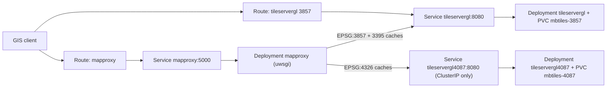

# RBT OpenShift Helm Chart

Port [docker-compose.4087.yaml](docker-compose.4087.yaml) (without the optional nginx from [docker-compose.override.yaml](docker-compose.override.yaml)) to a Helm chart that runs under OpenShift's `restricted-v2` SCC.

## Topology



## Chart layout

```
charts/rbt/
  Chart.yaml  values.yaml  README.md  .helmignore
  files/                      # copies of repo configs (see "Config sync" below)
    mapproxy/{mapproxy.yaml,mapproxy.4087.yaml,uwsgi.ini,logging.ini}
    tileserver/config.json
  templates/
    _helpers.tpl  _tileserver.tpl
    configmap-mapproxy.yaml  configmap-tileserver.yaml  secret-s3.yaml
    deployment-mapproxy.yaml  service-mapproxy.yaml  route-mapproxy.yaml
    tileservers.yaml          # renders Deployment+Service+PVC+Route per entry
    networkpolicy.yaml        # optional, default off
    NOTES.txt  tests/test-connection.yaml
Dockerfile.assets             # repo root; build context = repo root
```

## Key decisions

- **Config sync.** Helm cannot read files outside the chart directory and skips symlinks in `loader.LoadDir`, so `charts/rbt/files/` holds copies of `mapproxy/config/*` and `tileserver/config/config.json`. A `charts/rbt/sync-files.sh` copies them from the repo root and `--check` diffs them (for a future CI gate). This duplication is the one real tradeoff; call it out in the chart README.
- **Source URL rewrite.** `mapproxy.4087.yaml` hardcodes `url: http://tileservergl4087:8080/...` and `http://tileservergl:8080/...`. The ConfigMap template pipes `.Files.Get` through `replace` (4087 first, then the bare name) to point at the templated Service names.
- **Stack selector.** `tileservers.epsg4087.enabled` (default `true`) picks `mapproxy.4087.yaml`; setting it `false` falls back to `mapproxy.yaml`, so the chart covers both compose topologies.
- **Assets.** `Dockerfile.assets` copies `tileserver/fonts` (114MB) and `tileserver/styles` (5MB) into `/assets`, then `chgrp -R 0 /assets && chmod -R g=u /assets`, `USER 1001`. Too large and too binary for ConfigMaps. An init container `cp -a /assets/. /shared/` into an `emptyDir`, mounted into the main container at `/fonts` and `/styles` via `subPath`.
- **mbtiles.** One `ReadWriteOnce` PVC per projection (`rbt-mbtiles-3857`, `rbt-mbtiles-4087`), populated by an `aws-cli` init container mirroring [deploy.sh](deploy.sh): skip `TERRAIN.mbtiles` if present, re-pull `RBT.mbtiles` when `aws s3api head-object` LastModified differs from a stamp file, `--force` via values. Because the PVC is RWO, these Deployments use `strategy: Recreate`.
- **MapProxy cache.** `emptyDir` at `/data`, `/locks`, `/tile_locks` per your choice, so the tile cache rebuilds on restart and replicas scale freely.
- **S3 credentials.** Templated Secret with `AWS_ACCESS_KEY_ID`/`AWS_SECRET_ACCESS_KEY`, `s3.existingSecret` override, optional `AWS_ENDPOINT_URL` and `AWS_REGION`.

## OpenShift compatibility

- No `runAsUser`/`fsGroup` in the chart; the SCC injects them. Container `securityContext`: `allowPrivilegeEscalation: false`, `capabilities.drop: [ALL]`, `seccompProfile.type: RuntimeDefault`, `runAsNonRoot: true`. Document that vanilla Kubernetes additionally needs `securityContext.runAsUser` set, since both images declare a non-numeric `USER`.
- `HOME=/tmp` on every container. `tileserver-gl`'s `/home/node` and MapProxy's `/mapproxy` are owned by their named users and unwritable under an arbitrary UID; nothing at runtime needs a real home, and `docker-entrypoint.sh` only writes Xvfb state to `/tmp`.
- `shm_size: 2gb` becomes an `emptyDir` with `medium: Memory`, `sizeLimit: 2Gi` mounted at `/dev/shm`.
- All listeners are already unprivileged (5000, 8080). No `hostPort`, no `hostPath`.
- Probes reuse the compose checks: `exec node /usr/src/app/src/healthcheck.js` for TileserverGL (generous `startupProbe`, matching the 180s `start_period`) and `tcpSocket: 5000` for MapProxy.
- Routes use `tls.termination: edge` with `insecureEdgeTerminationPolicy: Redirect` and a `haproxy.router.openshift.io/timeout: 120s` annotation, since the router's 30s default will cut off cold-cache tile renders.
- When the TileserverGL route host is set, append `-u <publicUrl>` to its command so the preview UI emits correct absolute URLs behind the router.

## Values sketch

```yaml
mapproxy:
  image: ghcr.io/mapproxy/mapproxy/mapproxy:7.0.0-nginx
  replicas: 1
  uwsgi: { processes: 8, threads: 4 }
  resources: { requests: {cpu: 500m, memory: 2Gi}, limits: {memory: 6Gi} }
  route: { enabled: true, host: "" }
tileservers:
  epsg3857:
    enabled: true
    serviceName: tileservergl
    persistence: { size: 200Gi, storageClass: "" }
    s3: { rbtUri: "", terrainUri: "" }
    route: { enabled: true, host: "", publicUrl: "" }
  epsg4087:
    enabled: true
    serviceName: tileservergl4087
    route: { enabled: false }
assets: { image: "", pullPolicy: IfNotPresent }
s3: { existingSecret: "", accessKeyId: "", secretAccessKey: "", endpointUrl: "", region: us-east-1 }
```

## Verification

- `helm lint charts/rbt` and `helm template charts/rbt` for both `epsg4087.enabled` true/false; confirm the rendered MapProxy ConfigMap contains the templated Service hostnames, not the compose names.
- `kubeconform -strict` if available (`oc` is not installed locally and Docker is not running, so no live install or image build here).
- Post-install checklist in `docs/deployment-openshift.md`: pods Ready, `oc rsh` confirming `/mapproxy/config/mapproxy.yaml` starts with the 4087 sibling header (the silent-fallback failure mode from [docs/deployment-4087.md](docs/deployment-4087.md)), a WMTS tile fetch through the Route, and a check that WMS `GetCapabilities` `OnlineResource` URLs carry the route hostname and `https://` rather than a pod IP. If MapProxy ignores the router's `X-Forwarded-Proto`, fix it via an added uwsgi knob in `uwsgi.ini`.

## Docs

- New `docs/deployment-openshift.md`, linked from README "Deployment Options" as a fifth option alongside the four compose variants.
- `charts/rbt/README.md` with the values table, the S3 secret setup, and the config-sync caveat.