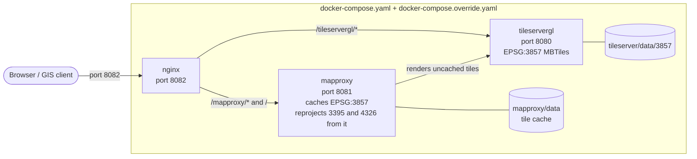
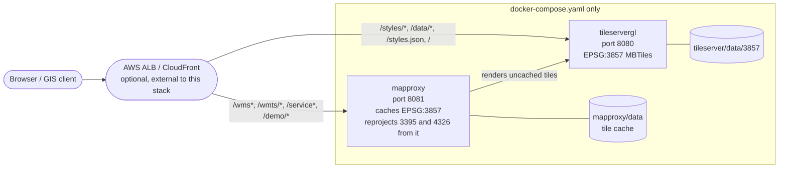
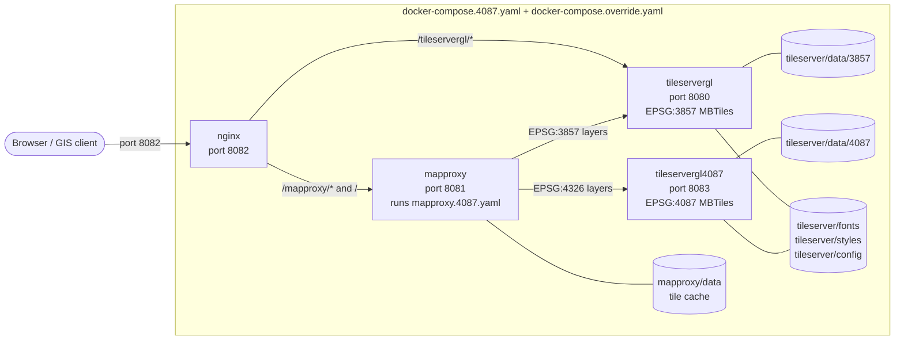
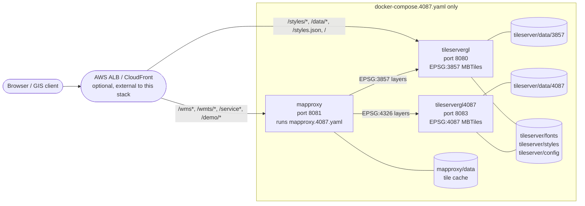

# Releasable Basemap Tiles (RBT)

RBT (Releasable Basemap Tiles) is a web application that provides map tiles for military and coalition partners. Think of it like Google Maps, but designed for military use with maps that can be safely shared internationally -- vector tiles instead of the older raster formats (like CADRG), for smaller files, sharper rendering at any zoom, and easier coalition sharing. See [Architecture](docs/architecture.md) for the full explanation, the technical design, and a diagram.

This guide walks through deploying RBT with **Docker Compose** on a single host (a workstation, VM, or on-premises server) running **macOS**, **Windows 11**, or **Linux**. Don't worry if you're new to any of these tools -- each command below is meant to be copied and pasted, one at a time.

## Requirements

- macOS, Windows 11 (natively, or via WSL2), or Linux
- Both container images this stack uses (`maptiler/tileserver-gl` and `ghcr.io/mapproxy/mapproxy/mapproxy`) publish `linux/amd64` and `linux/arm64` builds, so this runs on Intel/AMD and Arm64 hosts alike (including Apple Silicon)
- Internet connection, for downloading components and the MBTiles data
- Minimum 16GB of RAM and 8 cores CPU recommended
- Disk space: enough for the two MBTiles files described below, **plus** headroom for the MapProxy tile cache it builds over time. Ask the RBT team for current file sizes when you receive your S3 credentials -- the datasets are updated periodically, so we don't pin numbers here that would go stale

## Get S3 Credentials

Before starting, you need special access to download the map data:

1. Email [Tom Boggess](mailto:Thomas.J.Boggess@usace.army.mil) to request S3 credentials
2. Wait for approval and credentials (this may take a few days -- a good first step while you read the rest of this guide)
3. Once you receive credentials, configure AWS CLI by running:
   ```bash
   aws configure --profile rbt
   ```
   Enter the provided Access Key ID, Secret Access Key, and set the region to `us-east-1`

You'll use these credentials to download two files -- `RBT.mbtiles` and `TERRAIN.mbtiles` -- which `tileserver/config/config.json` references by these exact names. The Quickstart below downloads both automatically once your credentials and bucket paths are in place.

## Quickstart

1. **Install Git** if you don't already have it (most Macs and Linux systems do; on Windows 11 try `winget install Git.Git`, or see the per-OS guide below), then clone this repository and open a terminal inside it:

   ```bash
   git clone https://github.com/ReleaseableBasemapTiles/rbt-local.git
   cd rbt-local
   ```

2. **Copy `.env.example` to `.env`**, and fill in `S3_BUCKET_RBT` and `S3_BUCKET_TERRAIN` with the bucket paths the RBT team gave you alongside your credentials.

3. **Run the deploy script for your computer.** Each one installs every remaining prerequisite, downloads the map data, and starts RBT -- no other manual steps required.

   **macOS or Linux:**

   ```bash
   ./deploy.sh
   ```

   **Windows 11**, in PowerShell opened as Administrator:

   ```powershell
   .\deploy.ps1
   ```

Both scripts are safe to re-run: package installs are skipped when already present, `TERRAIN.mbtiles` only downloads once, and `RBT.mbtiles` re-downloads automatically whenever the S3 object is newer than your local copy. Run either with `--help` / `-Help` to see every available flag -- for example `--init`/`-Init` to just install prerequisites, `--no-nginx`/`-NoNginx` to skip the local reverse proxy (see [Advanced: Deploying Without nginx](docs/advanced-deployment.md)), or `--4087`/`-Use4087` to deploy a second TileserverGL container serving EPSG:4087 MBTiles for sharper EPSG:4326 output (see [Advanced: The EPSG:4087 Dual-TileserverGL Deployment](docs/deployment-4087.md)).

Prefer to see, or run, each step by hand instead of via the script? See [Installing on macOS](docs/install-macos.md), [Installing on Linux](docs/install-linux.md), or [Installing on Windows 11](docs/install-windows.md).

## Deployment Options

This repository's three Compose files combine into four deployments. All four publish the same MapProxy WMS/WMTS layers -- six styles, each in EPSG:3857, EPSG:3395, and EPSG:4326 -- so what differs is whether a local nginx fronts the services, and which projection the EPSG:4326 tiles are reprojected from. The diagrams below show default ports; every port is configurable in `.env` (see [.env.example](.env.example)). Options 3 and 4 name `docker-compose.4087.yaml` with an explicit `-f` instead of relying on the auto-discovered `docker-compose.yaml`, so `docker compose ps`/`logs`/`down` need those same `-f` flags -- `./deploy.sh`'s and `.\deploy.ps1`'s closing hints print the exact command for whichever stack you just deployed.

### 1. Default: nginx in front of both services

`docker compose up -d`, `./deploy.sh`, and `.\deploy.ps1` all deploy this stack. Compose merges `docker-compose.yaml` with `docker-compose.override.yaml`, which adds the local nginx reverse proxy and response cache, so everything is reachable through a single port. MapProxy and TileserverGL still publish their own ports too, which is what the [Direct Access](docs/gis-clients.md#3-direct-access-optional) section of the GIS clients guide uses.



### 2. Default without nginx (AWS ALB / CloudFront)

`./deploy.sh --no-nginx`, `.\deploy.ps1 -NoNginx`, or `docker compose -f docker-compose.yaml up -d` names the base file explicitly, which opts out of the automatic override merge, so nginx never starts. MapProxy and TileserverGL each serve their native paths -- no `/mapproxy` or `/tileservergl` prefix -- on their own published port, ready to be used as ALB target groups or CloudFront origins. See [Advanced: Deploying Without nginx](docs/advanced-deployment.md).



### 3. EPSG:4087 dual-TileserverGL with nginx

`./deploy.sh --4087` or `.\deploy.ps1 -Use4087` deploys `docker-compose.4087.yaml` in place of `docker-compose.yaml`, adding a second TileserverGL container that serves EPSG:4087 MBTiles from `tileserver/data/4087`, with nginx fronting all of it exactly like option 1. MapProxy runs `mapproxy.4087.yaml`, which builds its EPSG:4326 caches from that container instead of from EPSG:3857 -- a pure unit-scale conversion rather than a resample away from Web Mercator's distortion, so EPSG:4326 output stays sharp away from the equator. The EPSG:3857 and EPSG:3395 layers still come from the original container, and the published layer list is unchanged. See [Advanced: The EPSG:4087 Dual-TileserverGL Deployment](docs/deployment-4087.md).



### 4. EPSG:4087 dual-TileserverGL without nginx

`./deploy.sh --4087 --no-nginx`, `.\deploy.ps1 -Use4087 -NoNginx`, or `docker compose -f docker-compose.4087.yaml up -d` combines options 2 and 3: the same EPSG:4087-backed EPSG:4326 reprojection as option 3, but with nginx skipped like option 2. All three containers publish their own port directly -- MapProxy (`MAPPROXY_PORT`, default `8081`), the EPSG:3857 TileserverGL (`TILESERVER_PORT`, default `8080`), and the EPSG:4087 TileserverGL (`TILESERVER_4087_PORT`, default `8083`) -- ready to sit behind an ALB/CloudFront the same way option 2 does. See [Advanced: Deploying Without nginx](docs/advanced-deployment.md#combining-with-the-epsg4087-deployment).



## Verifying It's Working

See [Verifying Your Installation](docs/verify.md) for a full checklist. The short version:

```bash
docker compose ps               # all three services should be "running"/"healthy"
curl -fsS http://localhost:8082/healthz   # expect: ok
```

Open `http://localhost:8082/tileservergl/` in a browser to see the TileserverGL style previews.

## Stopping and Restarting

```bash
docker compose down --remove-orphans   # stop
docker compose up -d                   # start again
```

## Connecting GIS Clients

RBT works with QGIS, ArcGIS Pro, and other WMS/WMTS-capable GIS software. See [Connecting GIS Clients to RBT](docs/gis-clients.md) for connection URLs and step-by-step walkthroughs with screenshots.

## Troubleshooting

Something not working? See [Troubleshooting](docs/troubleshooting.md) for common issues and their solutions, or contact the RBT program manager for support.

## Further Reading

- [Architecture](docs/architecture.md) -- what RBT is, why it uses vector tiles, and the technical design
- [Installing on macOS](docs/install-macos.md), [Installing on Linux](docs/install-linux.md), [Installing on Windows 11](docs/install-windows.md) -- manual, step-by-step setup per OS
- [Verifying Your Installation](docs/verify.md)
- [Connecting GIS Clients to RBT](docs/gis-clients.md)
- [Advanced: Deploying Without nginx](docs/advanced-deployment.md) -- for AWS ALB/CloudFront deployments
- [Advanced: The EPSG:4087 Dual-TileserverGL Deployment](docs/deployment-4087.md) -- a second TileserverGL container serving EPSG:4087 MBTiles for sharper EPSG:4326 output
- [Troubleshooting](docs/troubleshooting.md)

## Glossary of Terms

- **CLI**: Command Line Interface - typing commands instead of clicking buttons
- **Docker**: Software that packages applications in containers
- **Container**: A packaged application with all its dependencies
- **Repository/Repo**: A project's code and files stored online
- **Terminal**: The application where you type commands
