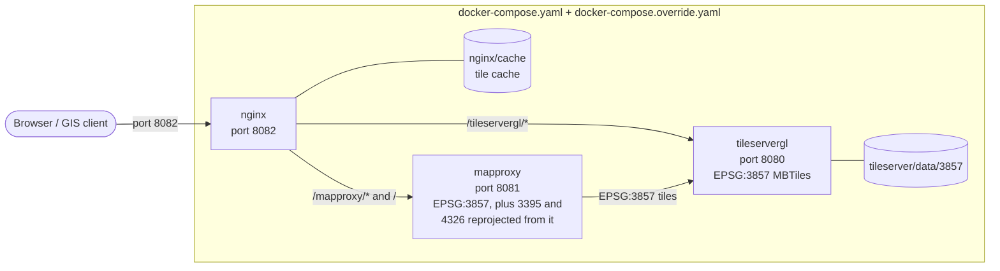

# Releasable Basemap Tiles (RBT)

RBT (Releasable Basemap Tiles) is a web application that provides map tiles for military and coalition partners. Think of it like Google Maps, but designed for military use with maps that can be safely shared internationally -- vector tiles instead of the older raster formats (like CADRG), for smaller files, sharper rendering at any zoom, and easier coalition sharing. See [Architecture](docs/architecture.md) for the full explanation, the technical design, and diagrams. Release history is in the [release notes](CHANGELOG.md); commit and pull-request titles follow [CONTRIBUTING.md](CONTRIBUTING.md).

This guide walks through deploying RBT with **Docker Compose** on a single host (a workstation, VM, or on-premises server) running **macOS**, **Windows 11**, or **Linux**. Don't worry if you're new to any of these tools -- each command below is meant to be copied and pasted, one at a time, and the [Glossary](#glossary-of-terms) at the end explains the terms this guide uses.

## Choose Your Path

| You want to... | Do this | Guide |
| --- | --- | --- |
| Run RBT on one machine, the quick way | Run `./deploy.sh` (macOS/Linux) or `.\deploy.ps1` (Windows) -- it downloads the [map data](#get-the-map-data) for you | [Quickstart](#quickstart) |
| Run each setup step yourself | Follow the manual guide for your OS | [macOS](docs/install-macos.md), [Linux](docs/install-linux.md), [Windows 11](docs/install-windows.md) |
| Put an AWS ALB or CloudFront in front, instead of the local nginx | Add `--no-nginx` (or `-NoNginx`) | [Deploying Without nginx](docs/advanced-deployment.md) |
| Get sharper EPSG:4326 maps | Add `--4087` (or `-Use4087`) | [The EPSG:4087 Deployment](docs/deployment-4087.md) |
| Run on Kubernetes or OpenShift | Use the Helm charts in the separate [ReleasableBasemapTiles/charts](https://github.com/ReleasableBasemapTiles/charts) repository -- this one covers Docker deployments only | [ReleasableBasemapTiles/charts](https://github.com/ReleasableBasemapTiles/charts) |
| Check a running deployment, or connect QGIS/ArcGIS | Start from the [endpoints](#endpoints) below | [Verifying](docs/verify.md), [GIS clients](docs/gis-clients.md) |

## Requirements

- macOS, Windows 11 (natively, or via WSL2), or Linux
- An Intel/AMD or Arm64 machine (including Apple Silicon): the `maptiler/tileserver-gl` and `nginx` images publish `linux/amd64` and `linux/arm64` builds, and Docker builds the MapProxy image on your machine from [`Dockerfile.mapproxy`](Dockerfile.mapproxy)
- Internet connection, for downloading components and the MBTiles data
- Minimum 16GB of RAM and 8 cores CPU recommended
- Disk space: enough for the two MBTiles files described below (four with the EPSG:4087 deployment), **plus** up to 10 GB for nginx's tile cache and room for the MapProxy image. The datasets are updated periodically, so we don't pin sizes here that would go stale -- the `aws s3 ls` command under [Get the Map Data](#get-the-map-data) lists the current ones

## Get the Map Data

RBT serves two map files -- `RBT.mbtiles` (the vector map) and `TERRAIN.mbtiles` (elevation data, for hillshading) -- which `tileserver/config/config.json` references by these exact names. Both are published on a public, read-only mirror, so **there's no access to request and no AWS credentials to set up**: the deploy scripts download them for you as part of the first deployment.

### How the deploy scripts download it

`./deploy.sh` (or `.\deploy.ps1` on Windows) runs a download step after installing the prerequisites and before starting the stack. It uses the AWS CLI -- which the script installs -- in anonymous mode (`--no-sign-request`) to copy each file from the mirror to the folder its TileserverGL container reads from:

| Deployment | Downloaded from the mirror | Into |
| --- | --- | --- |
| Every deployment | `s3://mbtiles/3857/RBT.mbtiles`, `s3://mbtiles/3857/TERRAIN.mbtiles` | `tileserver/data/3857/` |
| [EPSG:4087](docs/deployment-4087.md) (`--4087` / `-Use4087`) | `s3://mbtiles/4087/RBT.mbtiles`, `s3://mbtiles/4087/TERRAIN.mbtiles` | `tileserver/data/4087/` |

The files are large, so the first run takes a while. To check their current sizes (and your free disk space) beforehand:

```bash
aws s3 ls s3://mbtiles/ --recursive --human-readable --no-sign-request --region us-east-1 --endpoint-url https://rustfs-rbt-agc-dev.apps.kubic.dev.ngaxc.net
```

On later runs the download step only fetches what changed:

- `TERRAIN.mbtiles` is downloaded once, and then left alone.
- `RBT.mbtiles` is downloaded again whenever the mirror's copy is newer than yours.
- `--force` / `-Force` downloads both again regardless.
- Whenever a file is downloaded, the script restarts any running TileserverGL and empties nginx's tile cache, so a running stack serves the new data straight away.

To download or update just the data, without re-running the other steps:

```bash
./deploy.sh --download        # add --4087 for the EPSG:4087 deployment
```

```powershell
.\deploy.ps1 -Download        # add -Use4087 for the EPSG:4087 deployment
```

TileserverGL reads the files only at startup. If you replace them some other way on a running stack, run `./deploy.sh --refresh` (or `.\deploy.ps1 -Refresh`, adding `--4087`/`-Use4087` on that deployment) to restart it and empty nginx's tile cache.

### Using your own S3 bucket

This is optional -- most deployments should use the public mirror. To download from a different bucket instead (for example, a copy you host yourself), set `S3_BUCKET_RBT` and `S3_BUCKET_TERRAIN` in `.env` to that bucket's path (plus `S3_BUCKET_RBT_4087`/`S3_BUCKET_TERRAIN_4087` for `--4087`; see [`.env.example`](.env.example)). Then give the AWS CLI credentials for that bucket -- for example with `aws configure --profile rbt`, uncommenting `AWS_PROFILE=rbt` in `.env`. Any file whose variable you leave unset still comes from the public mirror.

## Quickstart

1. **Install Git** if you don't already have it (most Macs and Linux systems do; on Windows 11 try `winget install Git.Git`, or see the per-OS guide below), then clone this repository and open a terminal inside it:

   ```bash
   git clone https://github.com/ReleasableBasemapTiles/rbt-local.git
   cd rbt-local
   ```

2. **Optionally, copy `.env.example` to `.env`** to change ports, bind address, or other settings. You don't need it for the map data.

3. **Run the deploy script for your computer.** Each one installs every remaining prerequisite, downloads the map data from the public mirror (no credentials needed -- see [How the deploy scripts download it](#how-the-deploy-scripts-download-it)), and starts RBT. No other manual steps are required.

   **macOS or Linux:**

   ```bash
   ./deploy.sh
   ```

   **Windows 11**, in PowerShell opened as Administrator:

   ```powershell
   .\deploy.ps1
   ```

Both scripts are safe to re-run: package installs are skipped when already present, `TERRAIN.mbtiles` only downloads once, and `RBT.mbtiles` re-downloads automatically whenever the S3 object is newer than your local copy. Run either with `--help` / `-Help` to see every available flag -- for example `--init`/`-Init` to just install prerequisites, `--refresh`/`-Refresh` after changing MBTiles or styles, or the deployment options below.

Prefer to see, or run, each step by hand instead of via the script? See [Installing on macOS](docs/install-macos.md), [Installing on Linux](docs/install-linux.md), or [Installing on Windows 11](docs/install-windows.md).

## Deployment Options

This repository's three Compose files combine into four deployments on a single Docker host (for Kubernetes/OpenShift, see the separate [ReleasableBasemapTiles/charts](https://github.com/ReleasableBasemapTiles/charts) repository). All four publish the same MapProxy WMS/WMTS layers -- six styles, each in EPSG:3857, EPSG:3395, and EPSG:4326. What differs is whether a local nginx fronts (and caches) the services, and which projection the EPSG:4326 layers are reprojected from:

| Deployment | Deploy it with | Compose files | nginx and its tile cache | EPSG:4326 reprojected from |
| --- | --- | --- | --- | --- |
| 1. Default | `./deploy.sh`, `.\deploy.ps1`, or `docker compose up -d` | `docker-compose.yaml` + `docker-compose.override.yaml` | Yes | EPSG:3857 |
| 2. [Without nginx](docs/advanced-deployment.md) (AWS ALB / CloudFront) | `--no-nginx` / `-NoNginx` | `docker-compose.yaml` | No | EPSG:3857 |
| 3. [EPSG:4087](docs/deployment-4087.md) dual-TileserverGL | `--4087` / `-Use4087` | `docker-compose.yaml` + `docker-compose.4087.yaml` + `docker-compose.override.yaml` | Yes | EPSG:4087 |
| 4. EPSG:4087 without nginx | `--4087 --no-nginx` / `-Use4087 -NoNginx` | `docker-compose.yaml` + `docker-compose.4087.yaml` | No | EPSG:4087 |

The default deployment looks like this -- [Architecture](docs/architecture.md#deployment-variants) has a diagram of each:


```mermaid
flowchart LR
  client(["Browser / GIS client"])

  subgraph stack["docker-compose.yaml + docker-compose.override.yaml"]
    nginx["nginx<br/>port 8082"]
    tilecache[("nginx/cache<br/>tile cache")]
    mapproxy["mapproxy<br/>port 8081<br/>EPSG:3857, plus 3395 and<br/>4326 reprojected from it"]
    tileservergl["tileservergl<br/>port 8080<br/>EPSG:3857 MBTiles"]
    mbtiles[("tileserver/data/3857")]
  end

  client -->|"port 8082"| nginx
  nginx --- tilecache
  nginx -->|"/mapproxy/* and /"| mapproxy
  nginx -->|"/tileservergl/*"| tileservergl
  mapproxy -->|"EPSG:3857 tiles"| tileservergl
  tileservergl --- mbtiles
```

Every port is configurable in `.env` (see [.env.example](.env.example)). Deployments 2 to 4 name their Compose files with `-f`, so pass the same `-f` flags to later `docker compose` commands (a plain `docker compose up -d` switches back to deployment 1), or set `COMPOSE_FILE` in `.env` (see [.env.example](.env.example)). `./deploy.sh` and `.\deploy.ps1` finish by printing the exact commands for the stack they deployed.

## Endpoints

With the default ports, on the machine running RBT (from another machine, use its hostname instead of `localhost`):

| What | Through nginx (deployments 1 and 3) | Direct (every Compose deployment) |
| --- | --- | --- |
| Health check | `http://localhost:8082/healthz` (answers `ok`) | -- |
| MapProxy WMTS | `http://localhost:8082/mapproxy/wmts/1.0.0/WMTSCapabilities.xml` | `http://localhost:8081/wmts/1.0.0/WMTSCapabilities.xml` |
| MapProxy WMS | `http://localhost:8082/mapproxy/wms` | `http://localhost:8081/wms` |
| TileserverGL style previews | `http://localhost:8082/tileservergl/` | `http://localhost:8080/` |
| EPSG:4087 TileserverGL (deployments 3 and 4) | `http://localhost:8082/tileservergl4087/` | `http://localhost:8083/` |

Only requests through nginx are cached (see [Tile caching](docs/architecture.md#tile-caching)). [Connecting GIS Clients](docs/gis-clients.md) lists every MapProxy layer and the rest of TileserverGL's endpoints.

## Verifying It's Working

See [Verifying Your Installation](docs/verify.md) for a full checklist, including the differences for each deployment. The short version, for the default deployment:

```bash
docker compose ps               # all three services should be "running"/"healthy"
curl -fsS http://localhost:8082/healthz   # expect: ok
```

Open `http://localhost:8082/tileservergl/` in a browser to see the TileserverGL style previews.

## Stopping and Restarting

```bash
docker compose down --remove-orphans   # stop
docker compose up -d                   # start again
```

For deployments 2 to 4, add the same `-f` flags you deployed with (see [Deployment Options](#deployment-options)).

## Connecting GIS Clients

RBT works with QGIS, ArcGIS Pro, and other WMS/WMTS-capable GIS software. See [Connecting GIS Clients to RBT](docs/gis-clients.md) for connection URLs and step-by-step walkthroughs with screenshots.

## Troubleshooting

Something not working? See [Troubleshooting](docs/troubleshooting.md) for common issues and their solutions, or contact the RBT program manager for support.

## Further Reading

- [Architecture](docs/architecture.md) -- what RBT is, why it uses vector tiles, the technical design, a diagram of each deployment, and how tile caching works
- [Installing on macOS](docs/install-macos.md), [Installing on Linux](docs/install-linux.md), [Installing on Windows 11](docs/install-windows.md) -- manual, step-by-step setup per OS
- [Verifying Your Installation](docs/verify.md)
- [Connecting GIS Clients to RBT](docs/gis-clients.md)
- [Advanced: Deploying Without nginx](docs/advanced-deployment.md) -- for AWS ALB/CloudFront deployments
- [Advanced: The EPSG:4087 Dual-TileserverGL Deployment](docs/deployment-4087.md) -- a second TileserverGL container serving EPSG:4087 MBTiles for sharper EPSG:4326 output
- [Troubleshooting](docs/troubleshooting.md)
- [Release notes](CHANGELOG.md) -- what changed in each release
- [CONTRIBUTING.md](CONTRIBUTING.md) -- commit conventions and the checks CI runs on every pull request

## Glossary of Terms

- **CLI**: Command Line Interface - typing commands instead of clicking buttons
- **Container**: A packaged application with all its dependencies
- **Docker**: Software that packages applications in containers
- **Docker Compose**: The tool that starts this stack's containers together, from the `docker-compose*.yaml` files
- **EPSG code**: The ID of a map projection (coordinate reference system). RBT serves **EPSG:3857** (Web Mercator, what most web maps use), **EPSG:3395** (World Mercator), and **EPSG:4326** (WGS 84 latitude/longitude); the EPSG:4087 deployment also uses **EPSG:4087** (World Equidistant Cylindrical) internally, for sharper EPSG:4326 output
- **MapProxy**: The service that republishes TileserverGL's maps as WMS and WMTS, in several projections
- **MBTiles**: A single file holding a whole tile set. RBT's map data is two of them: `RBT.mbtiles` (the vector map) and `TERRAIN.mbtiles` (elevation data, for hillshading)
- **nginx**: The web server in front of the stack by default: one port for everything, plus a cache of the map images it has served
- **Repository/Repo**: A project's code and files stored online
- **Style**: The rules (colors, fonts, which features to draw at which zoom) that turn vector data into a map. RBT ships six, such as `RBT-TOPO` and `RBT-DARK`
- **Terminal**: The application where you type commands
- **TileserverGL**: The service that reads the MBTiles and draws map images from them in each style
- **WMS / WMTS**: Standards GIS software uses to request maps. WMS asks for one image of any area and size; WMTS asks for pre-cut tiles on a fixed grid, which cache better
