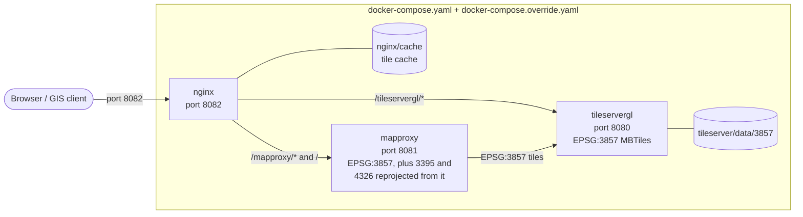
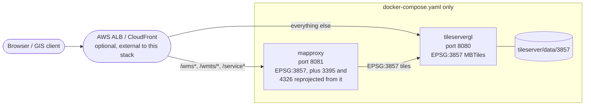
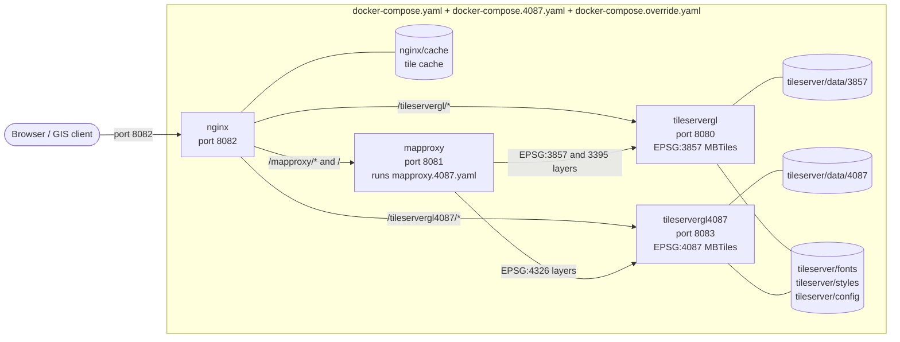
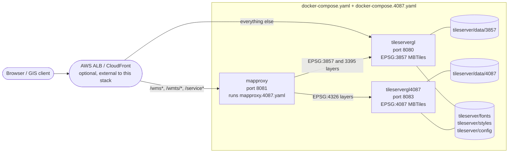

# Architecture

## What is RBT?

RBT (Releasable Basemap Tiles) is a web application that provides map tiles for military and coalition partners. Think of it like Google Maps, but designed for military use with maps that can be safely shared internationally.

### Why RBT is Better Than Older Map Systems

RBT uses **Vector Tiles** instead of the older **Raster Tiles** (like CADRG - Compressed ARC Digitized Raster Graphics) that the military has traditionally used. Here's why this matters:

**Think of it like this:**

- **Raster tiles (old way)** are like digital photographs of maps - they're made of pixels and have a fixed size and quality
- **Vector tiles (RBT's way)** are like digital drawings made of mathematical shapes and text that can be resized perfectly

**Key Advantages of Vector Tiles:**

🎯 **Better Quality at Any Zoom Level**

- Raster: Text becomes blurry when you zoom in (like enlarging a photo)
- Vector: Text and lines stay crisp at any zoom level

📦 **Smaller File Sizes**

- Raster: Large image files that take up lots of storage and bandwidth
- Vector: Compact mathematical descriptions that are 60-80% smaller

🌐 **Works Better Offline**

- Raster: Need to download many large image files for different zoom levels
- Vector: Download once, works smoothly at all zoom levels

⚡ **Faster Loading**

- Raster: Must load new images when zooming or panning
- Vector: Smooth transitions because data is already there

🎨 **Customizable Appearance**

- Raster: Fixed colors and styles (what you see is what you get)
- Vector: Can change colors, hide/show layers, adjust for day/night use

🔄 **Better for Coalition Sharing**

- Smaller files mean faster transfer over military networks
- Single vector dataset works for multiple use cases (instead of separate raster sets)
- Partners can customize the display for their specific needs

This makes RBT particularly valuable for military operations where bandwidth is limited, storage space is precious, and maps need to work reliably in various conditions.

## Why RBT Matters

The Releasable Basemap Tiles (RBT) is important because the capability can be easily shared with international coalition partners and doesn't need to go through the current approval process associated with traditional Limited Distribution (LIMDIS) data. The RBT is based on modern technology and provides access to like-in-kind Standard Map Products such as Topographic Map (TM), Joint Operations Graphic (JOG), and Tactical Pilotage Chart (TPC) in Vector Tiles format. This format enables rapid transfer across a network or accessed offline from a tile cache. By implementing simple changes in how modern maps are produced and accessed, international coalition partners will be able to track plans and activities using the same basemaps as U.S. services without delays associated with release of classified information.

## How It Works (Simple Version)

RBT uses several components working together:

- **TileserverGL**: Draws the map images (tiles) from the map data, in each of RBT's styles
- **MapProxy**: Republishes those maps through the WMS/WMTS standards that GIS software speaks, in several projections
- **nginx** (optional): Gives everything a single web address and port, and keeps a copy of each map image it serves so repeat requests are fast
- **Docker**: Packages everything together so it runs the same on any computer
- **Docker Compose**: The tool that manages and runs the application's containers together

## Technical Architecture

RBT is deployed as a containerized application using [TileserverGL](https://github.com/maptiler/tileserver-gl), which uses [MapLibre GL Native](https://maplibre.org/) for server-side rendering and serves vector and raster tiles in **EPSG:3857** (Web Mercator). [MapProxy](https://mapproxy.org/) sits in front of TileserverGL and republishes those raster tiles through standard OGC WMS/WMTS endpoints in **EPSG:3857** and, reprojected from them, **EPSG:3395** (World Mercator) and **EPSG:4326** (WGS 84 / geographic). Its WMS also reprojects on the fly to EPSG:4258, CRS:84, and EPSG:900913. MapProxy stores no tiles: in the deployments with nginx, nginx caches the rendered images (see [Tile caching](#tile-caching)).

An alternative deployment ([docs/deployment-4087.md](deployment-4087.md)) adds a second TileserverGL container serving **EPSG:4087** (World Equidistant Cylindrical) MBTiles, and reprojects the EPSG:4326 layers from those EPSG:4087 tiles instead of EPSG:3857 -- a pure unit-scale conversion rather than a resample away from EPSG:3857's angular distortion, so EPSG:4326 output is sharper away from the equator.

This guide documents a **Docker Compose** deployment suitable for a single host (a workstation, VM, or on-premises server) running macOS, Windows 11, or Linux. The deploy scripts download the MBTiles data that TileserverGL serves from a public mirror, with no credentials needed (see the main README's [Get the Map Data](../README.md#get-the-map-data)).

## Deployment Variants

The README's [Deployment Options](../README.md#deployment-options) compares the four Compose deployments. Each diagram below shows default ports; every port is configurable in `.env` (see [.env.example](../.env.example)).

### 1. Default: nginx in front of both services

`docker compose up -d`, `./deploy.sh`, and `.\deploy.ps1` all deploy this stack. Compose merges `docker-compose.yaml` with `docker-compose.override.yaml`, which adds the local nginx reverse proxy and tile cache, so everything is reachable through a single port. MapProxy and TileserverGL still publish their own ports too, which is what the [Direct Access](gis-clients.md#3-direct-access-optional) section of the GIS clients guide uses.

### 2. Default without nginx (AWS ALB / CloudFront)

`./deploy.sh --no-nginx`, `.\deploy.ps1 -NoNginx`, or `docker compose -f docker-compose.yaml up -d` names the base file explicitly, which opts out of the automatic override merge, so nginx never starts. MapProxy and TileserverGL each serve their native paths -- no `/mapproxy` or `/tileservergl` prefix -- on their own published port, ready to be used as ALB target groups or CloudFront origins. Nothing is cached: TileserverGL renders every request. See [Advanced: Deploying Without nginx](advanced-deployment.md).

### 3. EPSG:4087 dual-TileserverGL with nginx

`./deploy.sh --4087` or `.\deploy.ps1 -Use4087` adds the `docker-compose.4087.yaml` overlay to `docker-compose.yaml`, which adds a second TileserverGL container that serves EPSG:4087 MBTiles from `tileserver/data/4087`, with nginx fronting all of it exactly like deployment 1. MapProxy runs `mapproxy.4087.yaml`, an overlay on `mapproxy.yaml` that builds its EPSG:4326 layers from that container instead of from EPSG:3857 -- a pure unit-scale conversion rather than a resample away from Web Mercator's distortion, so EPSG:4326 output stays sharp away from the equator. The EPSG:3857 and EPSG:3395 layers still come from the original container, and the published layer list is unchanged. See [Advanced: The EPSG:4087 Dual-TileserverGL Deployment](deployment-4087.md).

### 4. EPSG:4087 dual-TileserverGL without nginx

`./deploy.sh --4087 --no-nginx`, `.\deploy.ps1 -Use4087 -NoNginx`, or `docker compose -f docker-compose.yaml -f docker-compose.4087.yaml up -d` combines deployments 2 and 3: the same EPSG:4087-backed EPSG:4326 reprojection as deployment 3, but with nginx skipped (and nothing cached) like deployment 2. All three containers publish their own port directly -- MapProxy (`MAPPROXY_PORT`, default `8081`), the EPSG:3857 TileserverGL (`TILESERVER_PORT`, default `8080`), and the EPSG:4087 TileserverGL (`TILESERVER_4087_PORT`, default `8083`) -- ready to sit behind an ALB/CloudFront the same way deployment 2 does. See [Advanced: Deploying Without nginx](advanced-deployment.md#combining-with-the-epsg4087-deployment).

Kubernetes/OpenShift deployments aren't covered here: their Helm charts live in the separate [ReleasableBasemapTiles/charts](https://github.com/ReleasableBasemapTiles/charts) repository.

## Tile Caching

MapProxy stores no tiles -- every cache in `mapproxy.yaml` sets `disable_storage`, so MapProxy asks TileserverGL for each tile it serves, and TileserverGL renders it. In the deployments with nginx (1 and 3), [`nginx/config/nginx.conf`](../nginx/config/nginx.conf) caches the results:

- **What's cached**: map images only -- tile and static-map URLs ending in `.png`, `.jpg`, `.jpeg`, or `.webp`, and WMS `GetMap`/`GetLegendGraphic` requests -- when the backend answers `200` with an `image/*` response. Capabilities documents, TileJSON, styles, fonts, and vector tiles always go to the backend, so they reflect the running configuration. WMS requests with `EXCEPTIONS=inimage` or `EXCEPTIONS=blank` aren't cached either, since their errors come back as ordinary `200` images.
- **For how long**: 30 days, whatever cache headers MapProxy and TileserverGL send, and up to 10 GB on disk in `nginx/cache/` (nginx evicts the least recently used images first). Images nobody requests for 30 days are removed too.
- **Checking it**: every response through port 8082 has an `X-Cache-Status` header: `MISS` when nginx had to fetch an image from the backend, `HIT` when it served one from the cache, and `BYPASS` for a request it never caches (`EXPIRED`, `STALE`, and `UPDATING` show up around a cached image's 30-day expiry, or while a backend is down). [Verifying Your Installation](verify.md) shows a `MISS` followed by a `HIT`.
- **Emptying it**: nginx can't tell when the MBTiles or styles behind a cached image change. `./deploy.sh --refresh` (or `.\deploy.ps1 -Refresh`, adding `--4087`/`-Use4087` in deployment 3) empties the cache and restarts TileserverGL; the deploy scripts do this automatically when their download step fetched new MBTiles. Run it yourself after replacing MBTiles or editing a style by hand.

Without nginx (deployments 2 and 4), nothing is cached and TileserverGL renders every request. For heavy traffic there, put a CDN or caching reverse proxy in front of MapProxy -- `nginx.conf` shows the policy this stack uses.

## Component Reference

- **[deploy.sh](../deploy.sh)** / **[deploy.ps1](../deploy.ps1)**: automate the manual setup steps in [Installing on macOS](install-macos.md), [Installing on Linux](install-linux.md), and [Installing on Windows 11](install-windows.md).
- **[docker-compose.yaml](../docker-compose.yaml)**: defines the `mapproxy` and `tileservergl` services.
- **[docker-compose.override.yaml](../docker-compose.override.yaml)**: adds the optional local `nginx` reverse-proxy/cache in front of them; Compose merges this in automatically unless you opt out (see [Advanced: Deploying Without nginx](advanced-deployment.md)). It layers onto the `docker-compose.4087.yaml` overlay the same way, so these three files combine into four deployments in total (see [Deployment Options](../README.md#deployment-options) in the README).
- **[docker-compose.4087.yaml](../docker-compose.4087.yaml)**: overlay on `docker-compose.yaml` that adds a second TileserverGL container serving EPSG:4087 MBTiles and points MapProxy at `mapproxy.4087.yaml` (see [Advanced: The EPSG:4087 Dual-TileserverGL Deployment](deployment-4087.md)).
- **[mapproxy/config/](../mapproxy/config/)**, **[nginx/config/](../nginx/config/)**, **[tileserver/config/](../tileserver/config/)**: the runtime configuration each service reads. `mapproxy/config/mapproxy.4087.yaml` is the MapProxy config for the `docker-compose.4087.yaml` stack: it includes `mapproxy/config/mapproxy.yaml` with MapProxy's `base:` and holds only the EPSG:4087 differences.
