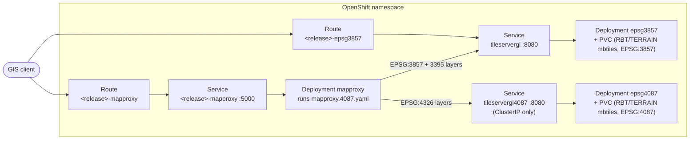

# Advanced: Deploying to OpenShift with Helm

The deployments elsewhere in this repo ([README.md](../README.md), [docs/advanced-deployment.md](advanced-deployment.md), [docs/deployment-4087.md](deployment-4087.md)) all run on a single Docker host via Compose. [`charts/rbt`](../charts/rbt) is a Helm chart that deploys the same three containers to a Kubernetes/OpenShift cluster instead: MapProxy plus two TileserverGL instances (EPSG:3857 and EPSG:4087), **with no nginx** -- the cluster equivalent of `docker compose -f docker-compose.4087.yaml up -d` (see [deployment-4087.md](deployment-4087.md) for why EPSG:4087 improves EPSG:4326 output, and [advanced-deployment.md](advanced-deployment.md) for why skipping nginx is a supported, documented configuration rather than a workaround).

This chart targets OpenShift's `restricted-v2` Security Context Constraint specifically. It also renders on plain Kubernetes, with one caveat covered in [charts/rbt/README.md#vanilla-kubernetes-without-an-scc](../charts/rbt/README.md#vanilla-kubernetes-without-an-scc).

## Architecture



Both TileserverGL Deployments also run a `copy-assets` init container (seeding fonts/styles from the image built by [`Dockerfile.assets`](../Dockerfile.assets)) and a `fetch-mbtiles` init container (downloading `RBT.mbtiles`/`TERRAIN.mbtiles` from S3 into their PVC), neither shown above -- see [charts/rbt/README.md](../charts/rbt/README.md) for what those do and how to configure them.

## Prerequisites

- `helm` 3.x and `oc` (or `kubectl`), authenticated against your cluster and project/namespace
- Push access to a container registry the cluster can pull from, for the assets image (step 1 below)
- The same S3 access this repo's other deployments need -- see the main README's [Get S3 Credentials](../README.md#get-s3-credentials) -- or pre-populated PVCs if you'd rather skip the in-cluster download (see [charts/rbt/README.md](../charts/rbt/README.md))

## Deploying

1. **Build and push the assets image** (fonts/styles -- see [charts/rbt/README.md#assets-image](../charts/rbt/README.md#assets-image)):

   ```bash
   docker build -f Dockerfile.assets -t <registry>/<repo>/rbt-assets:<tag> .
   docker push <registry>/<repo>/rbt-assets:<tag>
   ```

2. **Install the chart**, pointing it at that image and your S3 buckets. From a checkout of this repo (`charts/rbt`), or from GHCR after [`.github/workflows/helm-chart.yml`](../.github/workflows/helm-chart.yml) publishes it (`helm registry login ghcr.io` first -- the package is private):

   ```bash
   helm install rbt oci://ghcr.io/releasablebasemaptile/rbt-local/rbt --version 0.1.0 \
     --set assets.image.repository=<registry>/<repo>/rbt-assets \
     --set assets.image.tag=<tag> \
     --set s3.accessKeyId=<key> \
     --set s3.secretAccessKey=<secret> \
     --set tileservers.epsg3857.s3.rbtUri=s3://my-bucket/exports \
     --set tileservers.epsg3857.s3.terrainUri=s3://my-bucket/exports \
     --set tileservers.epsg4087.s3.rbtUri=s3://my-bucket-4087/exports \
     --set tileservers.epsg4087.s3.terrainUri=s3://my-bucket-4087/exports
   ```

   Or from the chart directory:

   ```bash
   helm install rbt charts/rbt \
     --set assets.image.repository=<registry>/<repo>/rbt-assets \
     --set assets.image.tag=<tag> \
     --set s3.accessKeyId=<key> \
     --set s3.secretAccessKey=<secret> \
     --set tileservers.epsg3857.s3.rbtUri=s3://my-bucket/exports \
     --set tileservers.epsg3857.s3.terrainUri=s3://my-bucket/exports \
     --set tileservers.epsg4087.s3.rbtUri=s3://my-bucket-4087/exports \
     --set tileservers.epsg4087.s3.terrainUri=s3://my-bucket-4087/exports
   ```

   See [charts/rbt/values.yaml](../charts/rbt/values.yaml) for every available key (Route hostnames, PVC sizes, resource requests/limits, etc.) -- a `-f myvalues.yaml` file is easier to manage than a long `--set` list for anything beyond a first try.

3. **Watch the rollout.** The first one takes a while -- each TileserverGL pod's `fetch-mbtiles` init container downloads the MBTiles from S3 before its main container even starts:

   ```bash
   oc get pods -w
   oc logs -f <epsg3857-pod> -c fetch-mbtiles
   ```

`helm install` prints Route URLs and a few sanity-check commands in its NOTES output when it finishes -- `helm get notes rbt` to see them again later.

### Single-TileserverGL mode

Set `--set tileservers.epsg4087.enabled=false` to deploy the plain-`mapproxy.yaml` equivalent of [docker-compose.yaml](../docker-compose.yaml) instead -- one TileserverGL instance, with EPSG:4326 reprojected from EPSG:3857 rather than EPSG:4087. See [charts/rbt/README.md#single-tileservergl-mode](../charts/rbt/README.md#single-tileservergl-mode).

## Verifying it's working

```bash
oc get pods
```

Expect every pod `Running` and `1/1`+ `Ready` -- TileserverGL pods can take a few minutes to pass their `startupProbe` while they open the MBTiles files, the same way their Compose healthcheck does (see [docs/verify.md](verify.md)).

```bash
helm test rbt
```

Expect `Phase: Succeeded` -- this fetches WMTS capabilities from MapProxy in-cluster (see [charts/rbt/templates/tests/test-connection.yaml](../charts/rbt/templates/tests/test-connection.yaml)).

```bash
oc exec deploy/rbt-mapproxy -- head -1 /mapproxy/config/mapproxy.yaml
```

Expect `# Sibling of mapproxy.yaml, used only by docker-compose.4087.yaml (see its` -- same silent-fallback failure mode as the Compose deployment (see [deployment-4087.md#the-4087-stack-is-up-but-epsg4326-tiles-look-unchanged](deployment-4087.md#the-4087-stack-is-up-but-epsg4326-tiles-look-unchanged)), just checked via `oc exec` instead of `docker exec`. With `tileservers.epsg4087.enabled=false`, expect `services:` instead.

```bash
curl -fsS "https://$(oc get route rbt-mapproxy -o jsonpath='{.spec.host}')/wmts/1.0.0/WMTSCapabilities.xml" | head -20
```

Expect an XML document starting with `<Capabilities` -- see [docs/verify.md](verify.md) for the full list of layers it should mention and an equivalent WMS `GetMap` check. Note there's no nginx response cache here, so unlike that guide's `X-Cache-Status` check, every request either hits MapProxy's own GeoPackage tile cache or renders fresh from TileserverGL -- there's no separate front-end cache layer to verify.

```bash
curl -fsS "https://$(oc get route rbt-epsg3857 -o jsonpath='{.spec.host}')/styles.json"
```

Expect a JSON array listing `RBT-TOPO`, `RBT-LIGHT`, `RBT-BROWN`, `RBT-GRAY`, `RBT-DARK`, and `RBT-OVERLAY`, same as the Compose deployment's TileserverGL preview.

## Ports and Routes

| Component | Service | Default port | Route by default? |
| --- | --- | --- | --- |
| MapProxy | `<release>-mapproxy` | 5000 | Yes (`mapproxy.route.enabled`) |
| TileserverGL (EPSG:3857) | `tileservergl` | 8080 | Yes (`tileservers.epsg3857.route.enabled`) |
| TileserverGL (EPSG:4087) | `tileservergl4087` | 8080 | No -- internal only; MapProxy's EPSG:4326 layers reproject from it in-cluster |

Every Route uses `tls.termination: edge` with an HTTP-to-HTTPS redirect. MapProxy's Route also carries a `haproxy.router.openshift.io/timeout: 120s` annotation (default 30s is tight for a cold-cache tile render, since MapProxy renders synchronously on a miss).

## Connecting GIS clients

Same URL shapes as [docs/gis-clients.md](gis-clients.md)'s ["Direct Access"](gis-clients.md#3-direct-access-optional) section -- no `/mapproxy`/`/tileservergl` prefix, since there's no nginx here either -- just with your Route's hostname (`https://...`) in place of `localhost:8081`/`localhost:8080`.

## Uninstalling

```bash
helm uninstall rbt
```

This deletes the PVCs `charts/rbt` created (unless you used `persistence.existingClaim`, which only detaches, never deletes, the PVC you pointed it at) -- back up `RBT.mbtiles`/`TERRAIN.mbtiles` first if a re-download from S3 isn't something you want to repeat.

## Further reading

- [charts/rbt/README.md](../charts/rbt/README.md) -- values reference, OpenShift-vs-vanilla-Kubernetes `securityContext` notes, and known limitations (Service-naming collisions across releases, MapProxy/TileserverGL startup ordering, `NetworkPolicy` coverage gaps)
- [Advanced: The EPSG:4087 Dual-TileserverGL Deployment](deployment-4087.md) -- what EPSG:4087 changes and why, independent of Compose vs. Helm
- [Advanced: Deploying Without nginx](advanced-deployment.md) -- the Compose equivalent of this chart's nginx-free design
- [Troubleshooting](troubleshooting.md)
