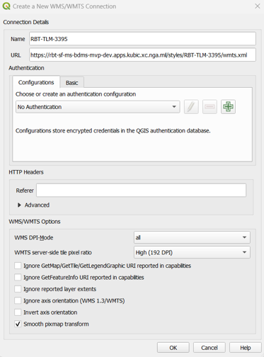
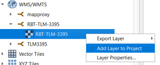
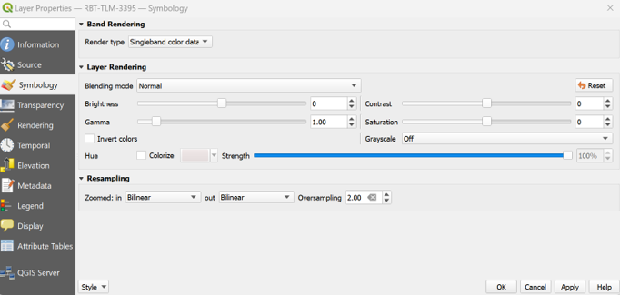
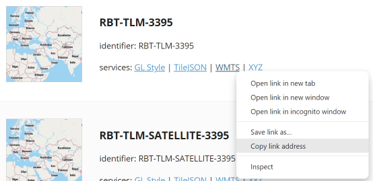
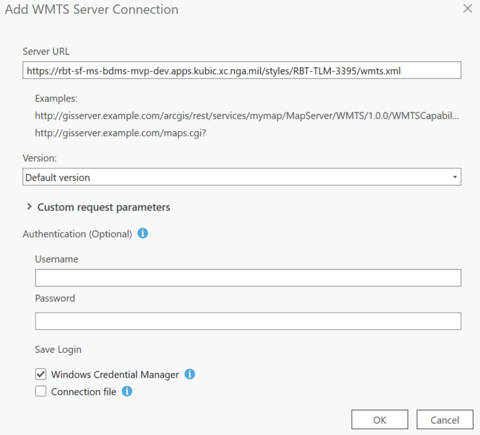
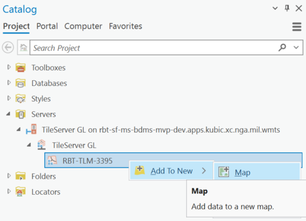

# Connecting GIS Clients to RBT

RBT provides multiple ways for GIS clients (like QGIS, ArcGIS, or Global Mapper) to connect and access map data. With the unified nginx routing, all services are accessible through a single port, `8082`.

Running without nginx (see [Advanced: Deploying Without nginx](advanced-deployment.md))? Each service is reached directly instead, with no `/mapproxy` or `/tileservergl` prefix -- see [Direct Access](#3-direct-access-optional) below.

## Available Service Endpoints

RBT exposes the following endpoints for GIS client connections through a unified nginx proxy on port 8082 (replace `localhost:8082` with your deployment URL in production):

### 1. MapProxy Services - Best for Standard GIS Clients

- **WMS**: `http://localhost:8082/mapproxy/wms`
- **WMTS**: `http://localhost:8082/mapproxy/wmts/1.0.0/WMTSCapabilities.xml`
- These provide cached raster tiles in standard OGC formats
- Compatible with virtually all GIS software

### 2. TileserverGL Services - For Modern GIS Clients

- **Web Interface**: `http://localhost:8082/tileservergl/`
- **WMTS per style**: `http://localhost:8082/tileservergl/styles/{style-id}/wmts.xml`
- **TileJSON**: `http://localhost:8082/tileservergl/styles/{style-id}.json`
- **Vector Tiles**: `http://localhost:8082/tileservergl/data/{data-id}/{z}/{x}/{y}.pbf`
- **Raster Tiles**: `http://localhost:8082/tileservergl/styles/{style-id}/{z}/{x}/{y}.png`

### 3. Direct Access (Optional)

MapProxy and TileserverGL each also publish their own port directly, bypassing nginx entirely (no `/mapproxy` or `/tileservergl` prefix, no nginx caching -- just the backend's native paths):

- **TileserverGL**: `http://localhost:8080` (port 8080)
- **MapProxy**: `http://localhost:8081/wms` or `http://localhost:8081/wmts/1.0.0/WMTSCapabilities.xml` (port 8081)

This is also what powers the nginx-free deployment described in [Advanced: Deploying Without nginx](advanced-deployment.md).

## Connecting to MapProxy WMTS (Recommended for Performance)

### From QGIS

1. In QGIS, go to **Layer -> Add Layer -> Add WMS/WMTS Layer**
2. Click **New** to create a new connection
3. Enter the connection details:
   - **Name**: `RBT MapProxy WMTS`
   - **URL**: `http://localhost:8082/mapproxy/wmts/1.0.0/WMTSCapabilities.xml`
   - For production, replace `localhost:8082` with your deployment URL
4. Click **OK**, then click **Connect**
5. Select the available layers and click **Add**
6. The MapProxy layers will be added to your map with optimal caching performance

### From ArcGIS Pro

1. In the **Catalog** pane, right-click **Servers** and select **Add WMTS Server**
2. Enter the Server URL:
   - `http://localhost:8082/mapproxy/wmts/1.0.0/WMTSCapabilities.xml`
   - For production, replace `localhost:8082` with your deployment URL
3. Click **OK** to save the connection
4. Expand the WMTS server connection and drag the desired layer to your map

## Connecting to TileserverGL WMTS (For Style Flexibility)

### From QGIS

1. Open the TileserverGL interface:
   - Local: `http://localhost:8082/tileservergl/`
   - Production: Replace with your deployment URL
2. Find the style you want and right-click the **WMTS** button, then select **Copy Link Address**
   - Example URL: `http://localhost:8082/tileservergl/styles/RBT-TOPO/wmts.xml`
3. In QGIS, right-click **WMS/WMTS** in the Browser panel and select **New Connection**

   

4. Enter the connection details:
   - **Name**: Your chosen name (e.g., `RBT-TOPO`)
   - **URL**: The WMTS URL copied in step 2
   - **WMTS server-side tile pixel ratio**: Choose **High (192 DPI)** for better quality

   

5. Click **OK** to save the connection
6. Expand your new WMTS connection, right-click the layer, and select **Add Layer to Project**

   

7. (Optional) Improve rendering quality:
   - Right-click the layer in the Layers panel and select **Properties**

   
   - Go to **Symbology** tab
   - Set **Resampling** to **Bilinear** for both "Zoomed in" and "Zoomed out"
   - Click **OK**

   

8. You now have a WMTS basemap from TileserverGL!

   

### From ArcGIS Pro

1. Open the TileserverGL interface:
   - Local: `http://localhost:8082/tileservergl/`
   - Production: Replace with your deployment URL
2. Find the style you want and right-click the **WMTS** button, then select **Copy Link Address**

   

3. Click the **Connections** dropdown in the ArcGIS Pro ribbon, select **Server**, then click **New WMTS Server**

   

4. In the **Add WMTS Server Connection** dialog:
   - Paste the URL from Step 2 into **Server URL**
   - Click **OK**

   

5. In the **Catalog** pane:
   - Expand **Servers**
   - Right-click your new WMTS layer
   - Select **Add To New Map** or **Add To Current Map**

   

6. You now have a WMTS basemap from TileserverGL!

   

## Advanced TileserverGL Endpoints

Based on the [TileserverGL documentation](https://tileserver.readthedocs.io/en/latest/endpoints.html), you can also access through the unified nginx proxy:

- **List all styles**: `http://localhost:8082/tileservergl/styles.json`
- **Style details**: `http://localhost:8082/tileservergl/styles/{style-id}/style.json`
- **Available fonts**: `http://localhost:8082/tileservergl/fonts.json`
- **Static images**: `http://localhost:8082/tileservergl/styles/{style-id}/static/{lon},{lat},{zoom}/{width}x{height}.png`
- **Data inspection**: `http://localhost:8082/tileservergl/data/{data-id}/{z}/{x}/{y}.geojson`

## Choosing the Right Endpoint

- **Use MapProxy endpoints** (`/mapproxy/*`) when:
  - You need maximum compatibility with older GIS software
  - You want cached tiles for better performance
  - You're using standard OGC protocols (WMS/WMTS)
- **Use TileserverGL endpoints** (`/tileservergl/*`) when:
  - You want vector tiles for dynamic styling
  - You need the latest style directly from the source
  - You're using modern GIS clients that support vector tiles

**Benefits of Unified Nginx Routing (Port 8082):**

- Single port for all services simplifies firewall rules
- Consistent URL structure for all endpoints
- Nginx provides additional caching and performance optimization
- Easier to implement SSL/TLS for all services
- Simplified proxy configuration for enterprise environments

## Available Styles in TileserverGL

- **RBT-TOPO**: Topographic style
- **RBT-LIGHT**: Light basemap style
- **RBT-BROWN**: Brown/sepia basemap style
- **RBT-GRAY**: Grayscale basemap style
- **RBT-DARK**: Dark theme style
- **RBT-OVERLAY**: Overlay style for use with imagery

Visit the TileserverGL interface to see all available styles and their previews. Screenshots elsewhere in this guide may still show older `-3395` style identifiers (e.g. `RBT-TOPO-3395`); TileserverGL renders every style in EPSG:3857, so those styles were renamed to drop the `-3395` suffix. EPSG:3395 and EPSG:4326 are still available -- MapProxy reprojects both, as described below.

## Available Layers in MapProxy

MapProxy exposes each style as a WMS/WMTS layer, three times: once in EPSG:3857, once in EPSG:3395, and once in EPSG:4326. Pick whichever matches your project CRS.

| Style | EPSG:3857 (Web Mercator) | EPSG:3395 (World Mercator) | EPSG:4326 (WGS 84 / Geographic) |
| --- | --- | --- | --- |
| RBT-TOPO | `rbt_topo_3857` | `rbt_topo_3395` | `rbt_topo_4326` |
| RBT-LIGHT | `rbt_light_3857` | `rbt_light_3395` | `rbt_light_4326` |
| RBT-BROWN | `rbt_brown_3857` | `rbt_brown_3395` | `rbt_brown_4326` |
| RBT-GRAY | `rbt_gray_3857` | `rbt_gray_3395` | `rbt_gray_4326` |
| RBT-DARK | `rbt_dark_3857` | `rbt_dark_3395` | `rbt_dark_4326` |
| RBT-OVERLAY | `rbt_overlay_3857` | `rbt_overlay_3395` | `rbt_overlay_4326` |

Only the `_3857` layers read from TileserverGL directly. Each `_3395` and `_4326` layer reprojects from its `_3857` counterpart rather than asking TileserverGL to render the style a second (or third) time.

Over WMTS, each layer is offered in one TileMatrixSet -- `webmercator` for the `_3857` layers, `world_mercator` for the `_3395` ones, and `geodetic` for the `_4326` ones. Over WMS, any layer can be requested in any of the service's advertised SRS (`EPSG:3857`, `EPSG:3395`, `EPSG:4326`, `EPSG:4258`, `CRS:84`, `EPSG:900913`), with MapProxy reprojecting as needed.

`RBT-OVERLAY` is the only transparent layer -- it is meant to be drawn on top of imagery. The other five are opaque basemaps.

## Troubleshooting GIS Client Connections

1. **Connection Failed**: Ensure Docker containers are running (`docker ps`), and check that your firewall allows connections on port 8082 (or 8080/8081 if bypassing nginx)
2. **No Layers Visible**: Check that you've downloaded the map data (see the main README's [Get S3 Credentials](../README.md#get-s3-credentials)) and check Docker logs: `docker compose logs`
3. **Slow Performance**: Use MapProxy endpoints for cached tiles
4. **Style Issues**: Vector tiles require GIS client support for MapLibre styles
5. **Projection Issues**: TileserverGL serves EPSG:3857 (Web Mercator) only, so set your QGIS/ArcGIS project CRS to EPSG:3857 when connecting to it (or let the client reproject on the fly). MapProxy is the one to use if you need another projection -- see [Available Layers in MapProxy](#available-layers-in-mapproxy) above for the EPSG:3395 and EPSG:4326 layers and the full list of SRS its WMS accepts

See also the main [Troubleshooting](troubleshooting.md) guide for Docker- and deployment-level issues.
