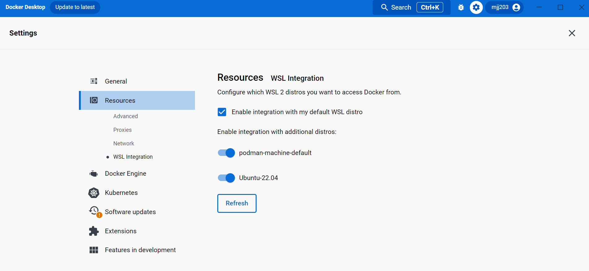

# Installing on Windows 11

RBT supports two ways to run on Windows 11:

- **[Option A: Native Windows 11](#option-a-native-windows-11-powershell--chocolatey)** -- installs everything directly on Windows via Chocolatey and Docker Desktop, with no WSL2 Linux distribution involved.
- **[Option B: WSL2](#option-b-wsl2)** -- runs RBT inside a WSL2 Ubuntu distribution, the same way as the [Linux install instructions](install-linux.md).

Both are fully supported; pick whichever fits how you already work on this machine. Each option below also has a one-command automated equivalent -- see the [Quickstart](../README.md#quickstart) in the main README.

## Option A: Native Windows 11 (PowerShell + Chocolatey)

This path installs everything directly on Windows using the [Chocolatey](https://chocolatey.org/) package manager and Docker Desktop -- no WSL2 Linux distribution is installed or used. Docker Desktop still relies on the WSL2 *platform* under the hood for its own internal Linux VM (that's normal, and required, even in this "native" path) -- but you never install or interact with a Linux distribution yourself, and every command below runs in PowerShell. This is the manual equivalent of running [`deploy.ps1`](../deploy.ps1).

### Step 1: Install Chocolatey, prerequisites, and Docker Desktop

Open **PowerShell as Administrator** (right-click Start menu -> "Terminal (Admin)" or "Windows PowerShell (Admin)"), then run:

```powershell
# Install Chocolatey (skip this if `choco --version` already works)
Set-ExecutionPolicy Bypass -Scope Process -Force
[System.Net.ServicePointManager]::SecurityProtocol = [System.Net.ServicePointManager]::SecurityProtocol -bor 3072
iex ((New-Object System.Net.WebClient).DownloadString('https://community.chocolatey.org/install.ps1'))

# Install AWS CLI v2, and Git + Git LFS (NoAutoCrlf keeps checkouts
# respecting this repo's .gitattributes -- see "A note on Git line
# endings" below)
choco install awscli -y
choco install git -y --params "'/NoAutoCrlf'"

# Enable the WSL2 platform with no Linux distribution -- Docker Desktop's
# own internal VM is all that needs it
wsl --install --no-distribution

# Install Docker Desktop (WSL2 engine, the package's default)
choco install docker-desktop -y
```

Restart Windows if either the `wsl --install` or Docker Desktop step asks you to, then continue below. After installing, either open a new PowerShell window (so it picks up the updated `PATH`) or run `refreshenv`.

### Step 2: Start Docker Desktop and confirm it's running

Launch **Docker Desktop** from the Start menu and wait for it to report "Engine running", then confirm from PowerShell:

```powershell
docker --version
docker compose version
```

Docker Desktop's installer adds you to the local `docker-users` group automatically; log out and back in if `docker` commands fail with a permissions error immediately after install.

### Step 3: Clone the repository

```powershell
git lfs install
git clone https://github.com/ReleaseableBasemapTiles/rbt-local.git
cd rbt-local
```

Clone to a path on your `C:` drive (e.g. `C:\Users\<you>\rbt-local`) rather than a network share or removable drive -- Docker Desktop's file sharing performs best on a local NTFS volume.

### Step 4: Prepare runtime directories and start RBT

Unlike Linux/WSL2, there's no `chown`/`chmod` step here -- Docker Desktop's Linux VM writes to bind-mounted Windows directories as whatever uid the container runs as, regardless of Windows ACLs. You do still need the runtime directories to exist, and this repo's config files need LF line endings for uWSGI to start (`.gitattributes` handles this automatically for new clones -- see [A note on Git line endings](#a-note-on-git-line-endings) below).

```powershell
# Download the map data (see "Get S3 Credentials" in the main README) before
# continuing, then start the RBT stack from the rbt-local directory
docker compose up -d

# Check logs
docker compose logs -f

# Stop the instance
docker compose down --remove-orphans
```

## Option B: WSL2

RBT runs inside a Linux environment on Windows using **WSL2** (Windows Subsystem for Linux). Whether you choose Docker Desktop or Docker Engine below, every command in the rest of this option runs **inside your WSL2 Linux distribution**, not in PowerShell or `cmd.exe`.

### Step 1: Enable WSL2

1. Open PowerShell as Administrator (right-click Start menu -> "Terminal (Admin)" or "Windows PowerShell (Admin)")
2. Run: `wsl --install`
3. Restart your computer when prompted
4. After restart, WSL finishes installing Ubuntu and prompts you to create a Linux username and password

If `wsl --install` isn't available on your system, follow Microsoft's [manual installation steps](https://learn.microsoft.com/en-us/windows/wsl/install-manual) instead. See the [WSL environment setup guide](https://learn.microsoft.com/en-us/windows/wsl/setup/environment#set-up-your-linux-username-and-password) for more on the username/password step.

### Step 2: Give WSL2 enough memory

WSL2 defaults to using **half of your host's RAM** (and 25% of its swap), shared across every distro you run. This stack alone recommends 16GB, so that default is too small on most laptops. Create (or edit) `%UserProfile%\.wslconfig` **in Windows** (i.e. `C:\Users\<you>\.wslconfig` -- not a path inside WSL) with at least:

```ini
[wsl2]
memory=16GB
swap=4GB
```

Then apply the change from PowerShell:

```powershell
wsl --shutdown
```

The new limits take effect the next time you open a WSL2 terminal. See Microsoft's [.wslconfig reference](https://learn.microsoft.com/en-us/windows/wsl/wsl-config) for the full set of options.

### Step 3: Choose Your Docker Setup

**Option A: Docker Engine inside WSL2 (Recommended)** - lighter weight, no separate GUI application. See [Docker Engine in WSL2](#docker-engine-in-wsl2) below.

**Option B: Docker Desktop with WSL2 backend** - adds a GUI and system tray app on top of the same WSL2 engine. See [Docker Desktop with WSL2](#docker-desktop-with-wsl2) below.

Both run the same Linux containers the same way; pick based on whether you want the GUI.

#### Docker Engine in WSL2

Open your WSL2 distribution (search "Ubuntu" in the Start menu) and run:

```bash
# Download and install AWS CLI
sudo apt-get update;
sudo apt-get install -y unzip ca-certificates curl gnupg lsb-release;
sudo update-ca-certificates;
curl "https://awscli.amazonaws.com/awscli-exe-linux-x86_64.zip" -o "awscliv2.zip" && \
    unzip awscliv2.zip && \
    sudo ./aws/install;

# Remove old Docker versions (if any exist)
sudo apt-get remove docker docker-engine docker.io containerd runc;

# Add Docker's official repository
sudo mkdir -m 0755 -p /etc/apt/keyrings;
curl -fsSL https://download.docker.com/linux/ubuntu/gpg | sudo gpg --dearmor -o /etc/apt/keyrings/docker.gpg;
echo \
  "deb [arch=$(dpkg --print-architecture) signed-by=/etc/apt/keyrings/docker.gpg] https://download.docker.com/linux/ubuntu $(lsb_release -cs) stable" \
  | sudo tee /etc/apt/sources.list.d/docker.list > /dev/null;
sudo chmod a+r /etc/apt/keyrings/docker.gpg;

# Install Docker, Git, and Git LFS
sudo apt-get update;
sudo apt-get install -y \
    docker-ce docker-ce-cli containerd.io \
    docker-buildx-plugin docker-compose-plugin \
    git-all git-lfs;

# Start the Docker service
sudo service docker start
```

WSL2 doesn't run background services automatically on every launch by default, so you may need to run `sudo service docker start` each time you open a new WSL2 session -- or enable [systemd support](https://learn.microsoft.com/en-us/windows/wsl/systemd) in `/etc/wsl.conf` to avoid that.

#### Docker Desktop with WSL2

1. Follow Docker's [Windows install instructions](https://docs.docker.com/desktop/install/windows-install/) and download the [installer](https://desktop.docker.com/win/main/amd64/Docker%20Desktop%20Installer.exe).
2. Start Docker Desktop, open **Settings -> General**, and confirm **Use the WSL 2 based engine** is checked.


Do **not** enable "Expose daemon on tcp://localhost:2375" -- that opens the Docker Engine API on your machine with no authentication. WSL integration (next step) already gives your Linux distro access to Docker without it.

1. Open **Settings -> Resources -> WSL Integration**, enable **Enable integration with my default WSL distro**, and turn on any additional distros you use.



1. From your WSL2 distribution, confirm Docker is reachable: `docker --version`
2. Install Git and Git LFS if you haven't already:

```bash
sudo apt-get install -y git-all git-lfs
git lfs install
```

### Step 4: Clone into the WSL2 filesystem (not `/mnt/c/...`)

Clone this repository into your **WSL2 Linux filesystem** -- your home directory (`~`), not a path under `/mnt/c/`. Windows drives are mounted into WSL2 through a 9P-based filesystem that is dramatically slower for the many small files this stack reads (fonts, styles, tile caches), and permission changes (`chmod`/`chown`) are silently ignored there.

```bash
cd ~
git clone https://github.com/ReleaseableBasemapTiles/rbt-local.git
cd rbt-local
```

### Step 5: Set permissions and start RBT

```bash
# The mapproxy container writes to these directories as uid/gid 1000,
# which is also the default uid/gid of the first user WSL creates for you.
sudo chown -R 1000:1000 mapproxy/data mapproxy/locks mapproxy/tile_locks
sudo chmod -R 775 mapproxy/data mapproxy/locks mapproxy/tile_locks nginx/cache nginx/logs nginx/run

# Download the map data (see "Get S3 Credentials" in the main README) before
# continuing, then start the RBT stack from the rbt-local directory
docker compose up -d

# Check logs
docker compose logs -f

# Stop the instance
docker compose down --remove-orphans
```

## A note on disk space

Everything in your WSL2 distribution -- including this repository and every MBTiles/GeoPackage file the stack downloads or creates -- lives inside a single virtual disk file (`ext4.vhdx`) that grows as needed but **does not shrink automatically** when you delete files. Make sure the Windows drive hosting your WSL2 distro has enough free space up front (this applies to Option B only; Option A's native Windows install uses your regular NTFS volume directly).

If you need to reclaim space later, see Microsoft's [WSL disk space guide](https://learn.microsoft.com/en-us/windows/wsl/disk-space), which covers compacting the `.vhdx` file, `wsl --manage <distro> --resize`, and moving a distro to a different drive.

## A note on the Windows Firewall

The first time you run `docker compose up -d`, Windows Defender Firewall may prompt you to allow network access, because this stack's ports are published on `0.0.0.0` (every network interface) by default. Choose **Allow** if you want other devices on your network to reach RBT. If you only need RBT on this machine, copy `.env.example` to `.env` and set `BIND_ADDR=127.0.0.1` to avoid the prompt entirely.

## A note on Git line endings

Windows' Git defaults to converting line endings on checkout (`core.autocrlf=true`). This repository's [`.gitattributes`](../.gitattributes) forces the config files this stack depends on (`nginx.conf`, `uwsgi.ini`, `mapproxy.yaml`, and similar) to always check out with Unix (`LF`) line endings, since a `uwsgi.ini` saved with Windows (`CRLF`) line endings prevents uWSGI from starting. If you cloned this repository before `.gitattributes` was added, either run `git config --global core.autocrlf input` and re-clone, or -- on native Windows (Option A) -- run `.\deploy.ps1 -Prep` to normalize the existing checkout in place without re-cloning.
